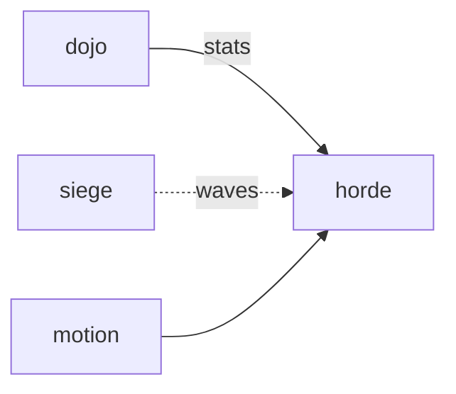

# Horde

**Pet Defense Corps** — A planned survival game with auto-attacking pets, trait-based upgrades, and ten-minute runs.

Part of [ComputerPets](https://github.com/RicheyWorks/computerpets). Map: [computerpets-ecosystem](https://github.com/RicheyWorks/computerpets-ecosystem).

[Status](#status) · [Design](docs/DESIGN.md) · [Contributor start](#contributor-start) · [Ecosystem](https://github.com/RicheyWorks/computerpets-ecosystem)

| Project | At a glance |
| --- | --- |
| Status | Design scaffold; not runnable yet |
| License | MIT |
| Tokens | Minigames never mint or burn. Tired overlay, not a dead lineage. |
| First pet | [Flagship start guide](https://github.com/RicheyWorks/computerpets/blob/main/docs/START-HERE.md) |

## Status

This repository contains a [design](docs/DESIGN.md) and a [source placeholder](src/game.gd). It has no runnable application, build manifest, automated tests, or CI workflow.

The experience, interfaces, integrations, and safeguards below are **implementation plans**, not supported features. The first implementation slice defines the initial contribution target.

## Planned experience

Dojo trains the numbers. Horde spends them. Weapon evolutions are trait-legal. 10-minute nightly run. Death = tired overlay, not a lost pet.

## Intended audience

One pet, ten minutes, nightly.

## Out of scope

A species-change evolution. Illegal upgrades filtered.

## Planned genre and engine

- Genre: **Bullet-heaven**
- Engine: **Godot**
- Stack: Godot 4 · Vampire Survivors-style waves · one pet you orbit-auto-attack
- Proposed surface: `Godot editor`

## Proposed integration



## Proposed play loop

1. Pick pet + starting trait weapon.
2. Survive waves. Choose 3-of-1 upgrades.
3. Chest loot = run-only until extract.
4. Extract at 10:00 or die trying.

## First implementation slice

Initial implementation target:

**Rui auto-attack, 3-of-1 upgrades, extract at 10:00 or die tired.**

Acceptance targets: Species-change upgrade filtered. Spawn cap on low CPU. Overlay continues if Horde is closed.

## Planned environment

Godot 4

## Planned safeguards

Upgrade that changes species → illegal, filtered. Low-end CPU → spawn cap. Overlay continues if Horde is closed.

Design constraints:

- 210 living kinds. No illegal hybrids.
- Overlay pets can get tired, sick, or hide. Tokens are not burned by a minigame.
- Desktop walk stays the main quest. Closing Horde must leave Rui walking.

## Related projects

- [computerpets-siege](https://github.com/RicheyWorks/computerpets-siege)
- [computerpets-dojo](https://github.com/RicheyWorks/computerpets-dojo)
- [computerpets-raid](https://github.com/RicheyWorks/computerpets-raid)
- [computerpets-motion](https://github.com/RicheyWorks/computerpets-motion)

## Layout

```
computerpets-horde/
  README.md
  LICENSE
  docs/DESIGN.md
  src/                implementation lands here
```

## Contributor start

With Git and PowerShell, clone the scaffold and read its design and source marker:

```powershell
git clone https://github.com/RicheyWorks/computerpets-horde.git
Set-Location computerpets-horde
Get-Content .\docs\DESIGN.md
Get-Content .\src\game.gd
```

Start with the [first implementation slice](#first-implementation-slice). Add the minimum project setup and tests needed for that slice, then document verified run commands. The proposed stack above is a design choice; there is no install or launch command for this checkout yet.

## Links

- Flagship: [RicheyWorks/computerpets](https://github.com/RicheyWorks/computerpets)
- This repo: [RicheyWorks/computerpets-horde](https://github.com/RicheyWorks/computerpets-horde)
- Map: [RicheyWorks/computerpets-ecosystem](https://github.com/RicheyWorks/computerpets-ecosystem)
- Design file: [docs/DESIGN.md](docs/DESIGN.md)

## License

MIT. See [LICENSE](LICENSE).

---

*Two hundred ten living kinds. Keep them so a line does not go quiet.*
