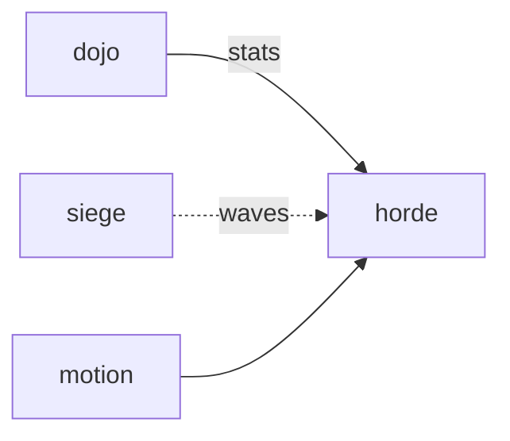

# Horde

**Pet Defense Corps** — Horde survival: auto-attack waves while you steer one pet. Siege is the desktop edge; Horde is the arena floor.

Part of [ComputerPets](https://github.com/RicheyWorks/computerpets). Map: [computerpets-ecosystem](https://github.com/RicheyWorks/computerpets-ecosystem).

| | |
| --- | --- |
| Status | Design scaffold — loop and engine frozen |
| License | MIT |
| Tokens | Minigames never mint or burn. Tired overlay, not a dead lineage. |
| First pet | [Meet Rui first](https://github.com/RicheyWorks/computerpets/blob/main/docs/START-HERE.md). This game is optional. |

## The loop

Dojo trains the numbers. Horde spends them. Weapon evolutions are trait-legal. 10-minute nightly run. Death = tired overlay, not a lost pet.

## Who plays

One pet, ten minutes, nightly.

## What it is not

A species-change evolution. Illegal upgrades filtered.

## Genre and engine

- Genre: **Bullet-heaven**
- Engine: **Godot**
- Stack: Godot 4 · Vampire Survivors-style waves · one pet you orbit-auto-attack
- Default surface: `Godot editor`

## Architecture



## How you play

1. Pick pet + starting trait weapon.
2. Survive waves. Choose 3-of-1 upgrades.
3. Chest loot = run-only until extract.
4. Extract at 10:00 or die trying.

## First slice

Build this and stop.

**Rui auto-attack, 3-of-1 upgrades, extract at 10:00 or die tired.**

You know it works when: Species-change upgrade filtered. Spawn cap on low CPU. Overlay continues if Horde is closed.

## Environment

Godot 4

## Failure doctrine

Upgrade that changes species → illegal, filtered. Low-end CPU → spawn cap. Overlay continues if Horde is closed.

Canon rules that never yield:

- 210 living kinds. No illegal hybrids.
- Overlay pets can get tired, sick, or hide. Tokens are not burned by a minigame.
- Desktop walk stays the main quest. Closing Horde must leave Rui walking.

## Neighbors

- computerpets-siege
- computerpets-dojo
- computerpets-raid
- computerpets-motion

## Layout

```
computerpets-horde/
  README.md
  LICENSE
  docs/DESIGN.md
  src/                implementation lands here
```

## Run (Windows)

```powershell
godot --path . ; F5
```

Meet Rui first via the [flagship start-here](https://github.com/RicheyWorks/computerpets/blob/main/docs/START-HERE.md). This game is optional.

## Links

- Flagship: [RicheyWorks/computerpets](https://github.com/RicheyWorks/computerpets)
- This repo: [RicheyWorks/computerpets-horde](https://github.com/RicheyWorks/computerpets-horde)
- Map: [RicheyWorks/computerpets-ecosystem](https://github.com/RicheyWorks/computerpets-ecosystem)
- Design file: [docs/DESIGN.md](docs/DESIGN.md)

## License

MIT. See [LICENSE](LICENSE).

---

*Two hundred ten living kinds. Keep them so a line does not go quiet.*
